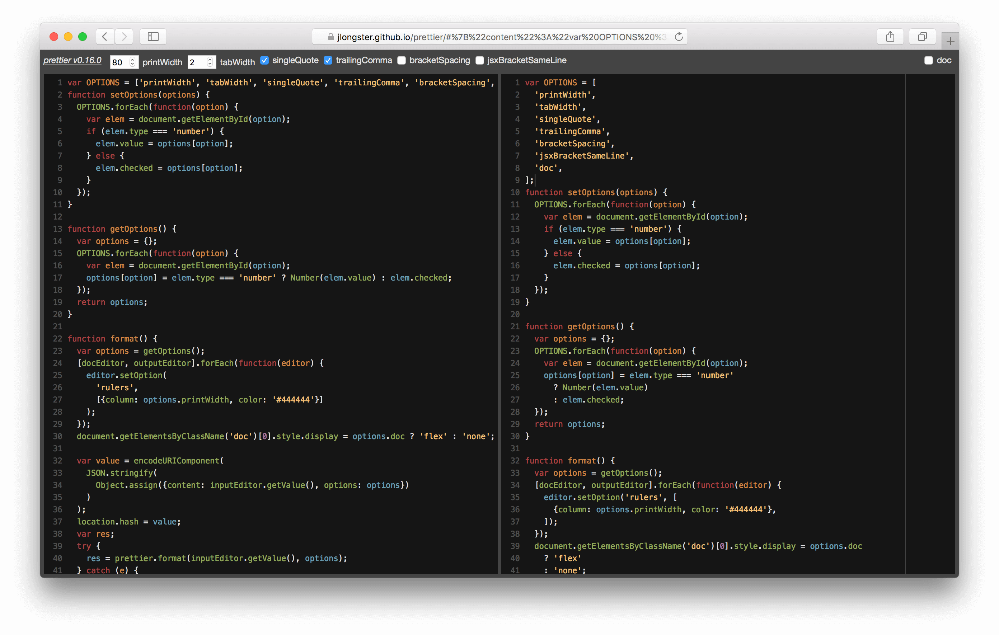

Работая в команде, очень тяжело избегать разногласий по поводу стиля написания кода. Даже если вы с коллегами договорились использовать линтер с самой строго настроенной конфигурацией, большинство различий в стиле всё равно будут проходить незамеченными. Многим командам очень тяжело сохранять какое-то подобие последовательного кода в проектах, и это сильно отвлекает.

<!-- more -->

Относительно недавно на сцене появился концептуально новый инструмент для форматирования JavaScript под названием [Prettier](https://github.com/jlongster/prettier). В отличие от других существующих форматтеров, Prettier не опирается на изначальный стиль кода, вместо этого печатая полученное из кода [АСД](https://ru.wikipedia.org/wiki/%D0%90%D0%B1%D1%81%D1%82%D1%80%D0%B0%D0%BA%D1%82%D0%BD%D0%BE%D0%B5_%D1%81%D0%B8%D0%BD%D1%82%D0%B0%D0%BA%D1%81%D0%B8%D1%87%D0%B5%D1%81%D0%BA%D0%BE%D0%B5_%D0%B4%D0%B5%D1%80%D0%B5%D0%B2%D0%BE) в одном постоянном формате. 👏

[](https://jlongster.github.io/prettier/)

После изначального запуска месяц назад, Prettier стремительно развивался и с тех пор избавился почти от всех значительных недочётов. Как мне кажется, сейчас Prettier уже готов к использованию в больших и серьёзных проектах. Для демонстрации его функционала, вы можете вставить свой код [сюда](https://jlongster.github.io/prettier/) и взглянуть на результат.

В этой статье я расскажу о том, как вы можете настроить Prettier в вашем проекте для удобного и безболезненного автоформатирования.

## Использование с ESLint

Для работы с JavaScript, мы в Anvilabs используем ESLint с нашей [собственной конфигурацией](https://github.com/anvilabs/eslint-config-anvilabs) на основе [стайлгайда от Airbnb](https://github.com/airbnb/javascript/tree/master/packages/eslint-config-airbnb).

С появлением Prettier в нашем инструментарии, большое количество стилистических правил в конфигурации стало ненужными. В конце концов, зачем беспокоиться о стиле, если Prettier потом всё сам отформатирует за тебя? :) Чтобы решить эту проблему, мы добавили в нашу конфигурацию поддержку [eslint-config-prettier](https://github.com/lydell/eslint-config-prettier), который отключает все правила, каким-то образом конфликтующие с Prettier.

Более того, нам не очень нравилось то, что для использования Prettier нужно было усложнять процесс разработки и заполнять голову какими-то новыми деталями про форматирование. Видимо, мы были не одни такие, потому что кто-то выпустил [специальный плагин](https://github.com/not-an-aardvark/eslint-plugin-prettier), позволяющий использовать Prettier как очередное правило для ESLint. Главное его удобство в том, что для форматирования кода с помощью Prettier теперь стало достаточно вызвать `eslint --fix`. ✨

## Автоформатирование при сохранении в VSCode

Мы в Anvilabs используем [Visual Studio Code](https://code.visualstudio.com/) в качестве основного редактора кода. Несмотря на то, что у Prettier есть специальное [дополнение для VSCode](https://github.com/esbenp/prettier-vscode), нам оно оказалось ненужным. Зачем, если у нас уже есть готовая интеграция с ESLint? Всё что остаётся сделать – это настроить VSCode для выполнения команды `eslint --fix` при каждом сохранении файла. Для этого надо всего лишь пройти несколько простых шагов:

1. Убедитесь, что у вас установлено дополнение [VSCode ESLint](https://github.com/Microsoft/vscode-eslint).

2. Создайте в вашем проекте файл `.vscode/settings.json`, если его ещё там нет.

3. Введите следующее в файл `settings.json`:

```json
{
  ...
  "eslint.autoFixOnSave": true,
  ...
}
```

И всё – теперь когда вы будете сохранять любой `.js` файл, вы будете запускать на нём Prettier для форматирования. ✨

## Форматирование всех изменённых файлов в коммите

Нужно учитывать, что возможно не у всех членов вашей команды будет настроена интеграция ESLint в кодовом редакторе. Чтобы удостовериться, что ваша кодовая база будет всегда отформатирована через Prettier, вы можете добавить запуск определенного скрипта перед выполнением команды `git commit`. Для этого мы можем использовать комбинацию инструментов [lint-staged](https://github.com/okonet/lint-staged) и [husky](https://github.com/typicode/husky). Ниже я привожу небольшую инструкцию для экономии вашего времени:

1. Установите `lint-staged` и `husky`:

```bash
$ yarn add lint-staged husky --dev # npm install lint-staged husky --dev
```

2. Добавьте необходимый скрипт и конфигурацию lint-staged в `package.json`:

```json
{
  ...
  scripts: {
    ...
    "precommit": "lint-staged",
    ...
  },
  ...
  "lint-staged": {
    "src/**/*.js": [
      "eslint --fix",
      "git add"
    ]
  },
  ...
}
```

Теперь каждый раз, когда вы или ваши коллеги будете выполнять коммит, `lint-staged` определит список изменённых JavaScript файлов и отформатирует их с помощью Prettier.

*Для нескольких директорий в конфигурации lint-staged вы можете использовать маску наподобие `{scripts,src}/**/*.js`.*


## Заключение

Надеюсь, эта статья оказалась вам полезной! Если вам нравится наш подход, вы можете использовать нашу [конфигурацию для ESLint](https://github.com/anvilabs/eslint-config-anvilabs) или форкнуть её, чтобы сделать свою собственную. 😉

С любыми вопросами или комментариями по статье, [пишите мне в Твиттере](https://twitter.com/yenbekbay).
