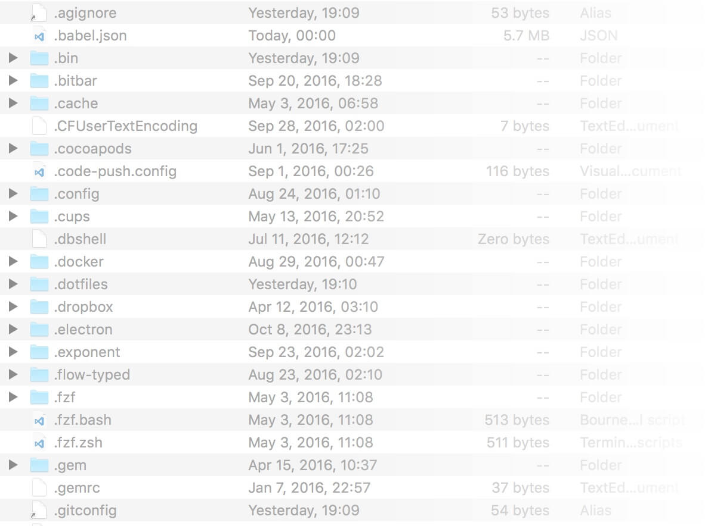
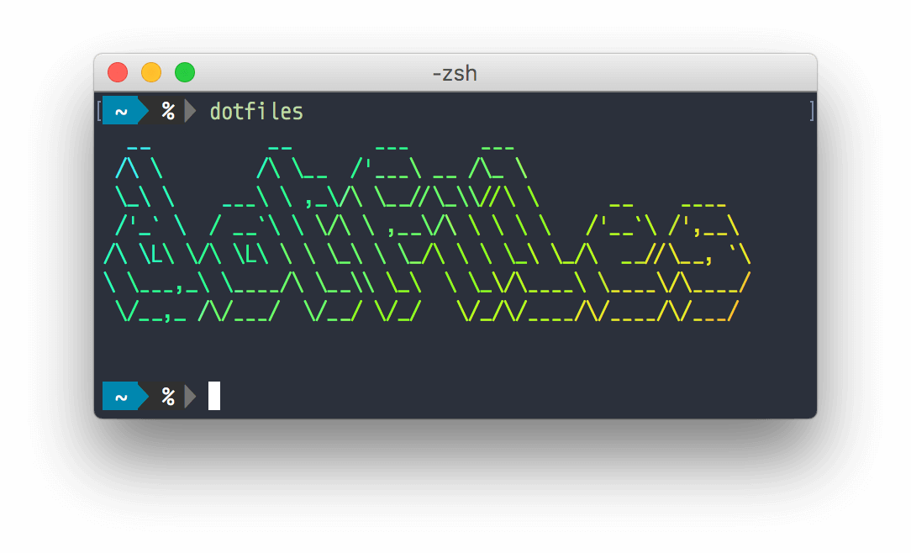
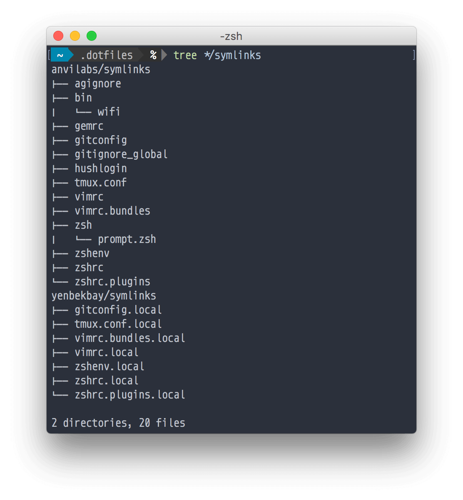

В [Unix](https://en.wikipedia.org/wiki/Unix) системах программы в командной строке как правило настраиваются с помощью простых текстовых файлов, которые находятся в корневой папке пользователя. Названия этих файлов по традиции начинаются с точки, и поэтому для обычного пользователя [по умолчанию невидимы](https://en.wikipedia.org/wiki/Hidden_file_and_hidden_directory)^[Причина тому, почему в Unix сложилась такая традиция, подробно описана [тут (на английском)](https://plus.google.com/101960720994009339267/posts/R58WgWwN9jp). Вкратце – в начале 1970-х годов это поведение файлов было простым программным багом, и с тех самых пор, как ни удивительно, осталось в Unix системах!].

<!-- more -->



Для пользователей Терминала, разумной инвестицией времени будет привести все свои "дотфайлы" в порядок, оптимизировав и подстроив их под себя. Проведя хоть чуточку времени за настройкой вашего рабочего окружения в командной строке, вы сможете значительно повысить свою продуктивность.

В последнее время все больше и больше разработчиков делятся и выставляют в открытый доступ свои "дотфайлы". Один только поиск в GitHub даст вам тысячи подобных репозиториев. Значит ли это, что вы можете просто клонировать чей-то репозиторий и радоваться, используя чужие настройки? **Нет.**

"Дотфайлы" подразумевают в себе хранение ваших *личных настроек*. То, что считает для себя оптимальным какой-то крутой разработчик, не означает, что вам тоже это обязательно подойдет. Копировать полностью чужую конфигурацию, не осознавая, что это за собой влечет – не принесет вам много пользы в долгосрочной перспективе.

Учитывая все вышесказанное, вы можете решить, что вам нужно делать все с нуля – однако "придумывать велосипед" тоже не стоит. Достаточно взять за основу какие-то базовые общепринятые настройки и строить поверх них.

Именно это и сделали ребята из [thoughbot](https://github.com/thoughtbot/dotfiles). Настройки в их репозитории по большому счёту применимы практически к любому прагматичному разработчику. Более того, используя [rcm](https://github.com/thoughtbot/rcm), их собственный инструмент для работы с "дотфайлами," они придумали очень удобный и изящный способ использовать собственные настройки, не теряя при этом возможности получать обновления от команды.

## Наше решение



Мы в Anvilabs, следуя примеру thoughtbot, тоже решили сделать что-то подобное для нашей команды и получили [вот такой результат](https://github.com/anvilabs/dotfiles). Стоит отметить, что на данный момент наше решение работает только на платформе macOS. Если вы хотите помочь с поддержкой других платформ – мы всегда рады принять ваш [Pull Request](https://github.com/anvilabs/dotfiles/pulls).

Мы пошли чуть дальше команды thoughtbot и добавили установочный скрипт, автоматизировав всю установку до одной команды. Вы можете взглянуть [на этот скрипт](https://raw.githubusercontent.com/anvilabs/dotfiles/master/install.sh) и запустить его с помощью следующей команды в терминале:

```bash
$ curl -fsSL https://raw.githubusercontent.com/anvilabs/dotfiles/master/install.sh | sh
```

Другая особенность нашего решения – это скрипт, позволяющий автоматически скачивать обновления всех глобальных модулей. Можете забыть о ручном вызове обновлений и ожидании окончания всех этих долгих установок. Обновления будут вызываться раз в день, сохраняя при этом историю в логах. Эти логи вы можете просмотреть, запустив следующую команду:

```bash
$ less +F ~/Library/Logs/update.sh.log
```

Ваши собственные кастомизации к "дотфайлам" вы можете добавить в `~/.dotfiles/<ваше_имя_пользователя>/symlinks/` с окончанием `.local`. Кастомизируемые симлинки включают в себя:

- `gitconfig.local`
- `tmux.conf.local`
- `vimrc.local`
- `vimrc.bundles.local`
- `zshenv.local`
- `zshrc.local`
- `zshrc.plugins.local`

К примеру, ваш `gitconfig.local` может выглядеть вот так:

```ini
[user]
  name = Ayan Yenbekbay
  email = ayan.yenb@gmail.com
  github = yenbekbay
  signingkey = ayan.yenb@gmail.com
[commit]
  gpgsign = true
[gpg]
  program = /usr/local/bin/gpg2
```

Когда вы закончите добавлять кастомные симлинки, структура папки `~/.dotfiles` должна быть примерно такой:



Но это не все – за более подробным описанием, пожалуйста, пройдите [в наш репозиторий](https://github.com/anvilabs/dotfiles).

---

Если вы не разбираетесь в Vim, но хотите научиться – рекомендую [этот отличный туториал](https://danielmiessler.com/study/vim/#gs.KNp0SO4). Вот [еще один только для tmux](https://danielmiessler.com/study/tmux/).
