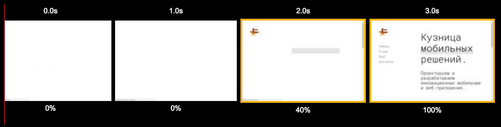
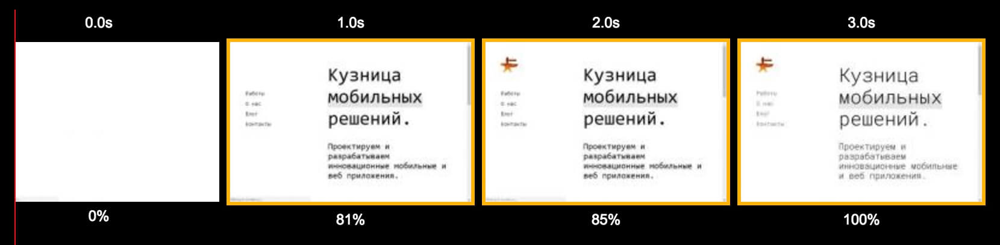
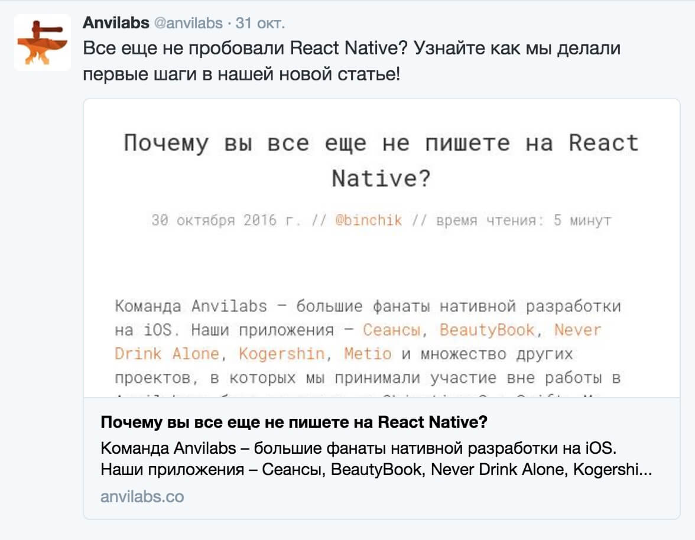

Этот сайт ([anvilabs.co](https://anvilabs.co)) работает на [Gatsby](https://github.com/gatsbyjs/gatsby) – новом статичном генераторе^[Если вы не знаете, что такое статичный генератор, рекомендую прочесть [отличную статью Эдуарда Боусаса на эту тему](https://davidwalsh.name/introduction-static-site-generators).], написанном специально для работы с [React](https://facebook.github.io/react/). В отличие от таких популярных решений как [Jekyll](https://github.com/jekyll/jekyll), [Hugo](http://gohugo.io/) или [Hexo](https://hexo.io/), Gatsby не использует шаблоны (темплейтинг) и вместо этого опирается на [Webpack](https://webpack.github.io/) и компоненты от React. В результате, вы получаете такие приятные плюшки как [автообновление](https://github.com/webpack/docs/wiki/hot-module-replacement-with-webpack) и моментальные переходы между страницами.

<!-- more -->

Для меня Gatsby был особенно ценной находкой, потому что с ним я, будучи разработчиком на React и React Native, могу использовать все те инструменты, которые я использую в своей повседневной работе.

В этой статье я расскажу о том, к каким трюкам я прибегал при работе с Gatsby, и что вы можете сделать, чтобы ваш сайт стал быстрее и привлекательнее. 

[[toc]]

*Кстати, весь исходный код для этого сайта открыт и [доступен на GitHub](https://github.com/anvilabs/anvilabs.co).*

*Приведённый код в этой статье написан на ES2016 с тайпингом на [Flow](https://flowtype.org/). Имейте это в виду перед тем, как что-то копировать к себе*. 

## Использование веб-шрифтов

Если на своем сайте вы используете веб-шрифты, существуют два явления, с которыми вы можете столкнуться:

* **FOIC** (“flash of invisible content”) – когда ваш браузер пытается стилизовать текст шрифтом, который он еще не успел загрузить. В результате этого явления, весь текст, использующий веб-шрифты на странице, становится будто бы написанным невидимыми чернилами.



* **FOUC** (“flash of unstyled content”) – вместо того чтобы показывать невидимые чернила, браузер стилизует текст запасным шрифтом и заменяет его на ваш веб-шрифт, когда тот наконец подгружается.



Google Chrome переходит на FOUC – перестает ждать окончание загрузки веб-шрифта – через 3 секунды (или 0 секунд при 2G подключении). Но в некоторых других браузерах, в том числе в Safari на iOS устройствах, такого поведения не наблюдалось – то есть вы получаете только FOIC и вынуждены ждать загрузки веб-шрифта перед тем, как иметь возможность что-то прочитать.

### Предотвращение FOIC

Чтобы минимизировать FOIC на вашем сайте вы можете использовать [Font Face Observer](https://github.com/bramstein/fontfaceobserver) или [Web Font Loader](https://github.com/typekit/webfontloader).

На этом сайте, в частности, я использовал Web Font Loader. Ниже представлены все шаги, которые вам нужно выполнить чтобы интегрировать Web Font Loader в ваш проект (оригинальные коммиты: [5af2cc](https://github.com/anvilabs/anvilabs.co/commit/5af2cc61fbfd47d115df9e16b355f159dc8961f9), [cf2c49](https://github.com/anvilabs/anvilabs.co/commit/cf2c499973ffe1e55e5c4eba3b966b8fa9fcb8c7))

1. Создайте компонент `WebFonts.js` и впишите туда следующее:

```js
/* @flow */

import React from 'react';

const WebFonts = (
  { config }: { config: { [key: string]: Object } },
): ?React$Element<any> => {
  const snippet = `
(function() {
  if (WebFont) WebFont.load(${JSON.stringify(config)});
})();
  `;

  return (
    <script
      type="text/javascript"
      // eslint-disable-next-line react/no-danger
      dangerouslySetInnerHTML={{ __html: snippet }}
    />
  );
};

export default WebFonts;
```

2. В `html.js` импортируйте компонент `WebFonts` и сделайте следующие изменения:

```js
...
import { WebFonts } from './components';

const Html = ({ body }: { body: string }): React$Element<any> => {
  return (
    <html>
      ...
      <body>
        ...
        <script src="https://ajax.googleapis.com/ajax/libs/webfont/1.6.16/webfont.js" />
        <WebFonts
          config={{
            // конфигурация Web Font Loader: https://github.com/typekit/webfontloader#configuration
            google: {
              families: ['Roboto+Mono:300,400:cyrillic'],
            },
          }}
        />
        ...
      </body>
    </html>
  );
};
...
```

3. Откройте свой CSS файл и оберните стили с веб-шрифтами в селектор `.wf-active`:

```scss
.wf-active {
  body {
    font-family: "roboto mono";
  }
}
```

Если вы все сделали правильно, на вашем сайте больше не должно быть проблем с FOIT. 👏  

*Если вы используете Google Fonts, вы можете скачивать шрифты для локального использования с помощью [gulp-google-webfonts](https://github.com/anvilabs/anvilabs.co/commit/d05e69ab485edcd1cabe192a1cec23c8d82677eb). Вот [коммит, ответственный за это изменение](https://github.com/anvilabs/anvilabs.co/commit/d05e69ab485edcd1cabe192a1cec23c8d82677eb).*

## Неиспользованные CSS стили

Как вы можете представить, при употреблении CSS-фреймворков зачастую многие из предоставленных ими стилей остаются неиспользованными. Даже если вы предпочитаете писать свой собственный CSS, вы все равно можете столкнуться с такой проблемой при достаточно большой кодовой базе.

Для решения этой проблемы были придуманы такие инструменты как [uncss](https://github.com/giakki/uncss) и [purifycss](https://github.com/purifycss/purifycss). В проведенных мной тестах, uncss показал себя значительно лучше чем purifycss, поэтому для этого сайта я решил остановиться именно на нём.

### Удаление неиспользованных стилей с uncss

Чтобы сэкономить вам немного времени, я привожу небольшую инструкцию по интеграции uncss в ваш проект на Gatsby:

1. Установите все необходимые модули:

```bash
$ yarn add gulp-uncss gulp-inline-source gulp-minify-inline --dev # npm install gulp-uncss gulp-inline-source gulp-minify-inline --save-dev
```

2. Добавьте следующие задачи в `gulpfile.babel.js`:

```js
/* @flow */

import gulp from 'gulp';
import inlinesource from 'gulp-inline-source';
import minifyInline from 'gulp-minify-inline';
import uncss from 'gulp-uncss';

gulp.task('uncss', () => gulp
  .src('./public/styles.css')
  .pipe(uncss({
    html: ['public/**/*.html'],
    ignore: [
      // укажите тут селекторы, которые могут быть пропущены
    ],
  }))
  .pipe(gulp.dest('./public')),
);

gulp.task('inlinesource', ['uncss'], () => gulp
  .src('./public/**/*.html')
  .pipe(inlinesource({ attribute: 'data-inline' }))
  .pipe(gulp.dest('./public')),
);

gulp.task('minifyinline', ['inlinesource'], () => gulp
  .src('./public/**/*.html')
  .pipe(minifyInline())
  .pipe(gulp.dest('./public')),
);

gulp.task('minifycss', ['uncss', 'inlinesource', 'minifyinline']);
```

3. Добавьте атрибут `data-inline` к тегу ваших стилей в `html.js`:

```js
const Html = ({ body }: { body: string }): React$Element<any> => {
  return (
    <html>
      <head>
        ...
        {process.env.NODE_ENV !== 'development' && <link data-inline rel="stylesheet" href="/styles.css" />}
        ...
      </head>
      ...
    </html>
  );
};
```

4. Откройте `package.json` и отредактируйте ваш скрипт для генерации сайта, добавив туда вызов задачи `minifycss`. Пример скрипта:

```json
{
  ...
  "scripts": {
    ...
    "build": "rimraf public && gatsby build && gulp minifycss",
    ...
  },
  ...
}
```

Теперь когда вы будете генерировать ваш сайт:
  * Ваш `styles.css` будет пропущен через uncss для удаления ненужных стилей.
  * Все полученные стили из `styles.css` будут вставлены прямо в html (с помощью [inline-source](https://github.com/popeindustries/inline-source)).
  * Стили будут дополнительно минимизированы с [gulp-minify-inline](https://github.com/shkuznetsov/gulp-minify-inline).

*Этим способом я смог сократить стили на сайте с ~45кб до менее чем 7кб.* 

## Скриншоты страниц в качестве картинок для метатегов 

Если вы когда либо делились ссылкой в социальных сетях или в мессенджерах, вы могли заметить, что к ссылкам зачастую автоматически закрепляются картинки:




Помимо того, что ссылки с картинками как правило привлекают больше внимания, присутствие качественной картинки в метатегах может существенно повысить положение вашего сайта в поисковой выдаче.

Для этого блога картинки для метатегов однако не берутся из статьи. Я решил пойти немного другой дорогой и начал использовать скриншоты самих статей для этой роли. Вы можете сделать то же самое, проследовав следующей короткой инструкции:

1. Установите все необходимые модули:

```bash
$ yarn add gulp glob pageres --dev # npm install gulp glob pageres --save-dev
```

2. Добавьте следующую задачу в `gulpfile.babel.js`:

```js
/* @flow */

import path from 'path';

import glob from 'glob';
import gulp from 'gulp';
import Pageres from 'pageres';

gulp.task('pageres', () => {
  glob
    .sync('public/blog/*/index.html') // измените путь для вашего проекта
    .forEach((file: string) => {
      const pageres = new Pageres({
        crop: true,
        filename: 'screenshot-<%= size %>',
        delay: 2,
        css: '', // стили, которые вы хотите применить к странице перед созданием скриншота
        format: 'jpg',
      });

      pageres
        .src(file, ['1200x630', '600x315']) // рекомендуемые размеры для Facebook и Twitter
        .dest(path.dirname(file))
        .run((err: ?Error) => {
          if (err) {
            console.log(err); // eslint-disable-line no-console
          }
        });
    });
});
```

3. Откройте `package.json` и отредактируйте ваш скрипт для генерации сайта, добавив туда вызов задачи `pageres`. Пример скрипта:

```json
{
  ...
  "scripts": {
    ...
    "build": "rimraf public && gatsby build && gulp pageres",
    ...
  },
  ...
}
```

4. Укажите путь для тегов `og:image` и `twitter:image` на скриншоты. В проекте этого сайта это делается через компонент [`PageHelmet`](https://github.com/anvilabs/anvilabs.co/blob/master/components/PageHelmet.js). Вы можете посмотреть пример реализации для страниц блога [тут](https://github.com/anvilabs/anvilabs.co/blob/master/wrappers/md.js).

5. Проверьте, что все сработало:
    * Сгенерируйте сайт: `yarn run build` или `npm run build`
    * Запустите его локально через `gatsby serve`
    * Настройте тоннель с помощью [localtunnel](https://localtunnel.github.io/www/)
    * Протестируйте отображение мета информации через [richpreview.com](http://richpreview.com/)

## Публикация сайта на Netlify

[Netlify](https://www.netlify.com/) – это сервис для хостинга статичных сайтов через глобальный CDN. Я выбрал именно его, а не [Github Pages](https://pages.github.com/) или [Surge.sh](http://surge.sh/), потому что из них только Netlify бесплатно предоставляет автоматическую установку SSL сертификатов.

В Netlify существует интеграция с GitHub, позволяющая автоматически регенерировать сайт при каждом пуше. Минусом такого подхода, в отличие от ручных загрузок, является ограничение в 50 билдов в месяц. Из-за этого ограничения и из-за очень медленных билдов на Netlify, я решил автоматизировать ручную загрузку сайта на Netlify с помощью [скриптов в Travis](https://docs.travis-ci.com/user/deployment/). Ниже я делюсь списком шагов, которые позволят вам сделать загрузку вашего сайта на Netlify быстрой и безболезненной:

1. Зарегистрируйтесь на [Netlify](https://app.netlify.com/signup) и в [Travis CI](https://travis-ci.org/).

2. Установите `netlify-cli` и `travis`:

```bash
$ yarn global add netlify-cli # npm install -g netlify-cli
$ yarn add netlify-cli --dev # npm install netlify-cli --save-dev
$ gem install travis
```

3. Настройте Travis для вашего сайта:

```bash
$ travis init
```

4. Добавьте ваш сайт в Netlify:

```bash
$ netlify create --name <site_name> --custom-domain <custom_domain>
```

5. Скопируйте значение поля `access_token` из файла `~/.netlify/config` и запустите следующую команду:

```bash
$ travis env set NETLIFY_TOKEN <access_token> 
```

6. Откройте `package.json` и добавьте туда скрипт `deploy`:

```json
{
  ...
  "scripts": {
    ...
    "deploy": "gatsby build && netlify deploy --path public",
    ...
  },
  ...
}
```

7. Откройте `.travis.yml` и вставьте туда следующее:

```yml
language: node_js
node_js:
- '6'
install:
- npm install -g yarn
- yarn
cache:
  directories:
  - "~/.yarn-cache"
  - "~/.nvm"
deploy:
  provider: script
  skip_cleanup: true
  script: chmod +x ./scripts/deploy.sh && ./scripts/deploy.sh
  on:
    branch: master
```

8. Создайте скрипт в `scripts/deploy.sh` и впишите туда следующее:

```bash
#!/usr/bin/env bash

npm run deploy --silent -- -t $NETLIFY_TOKEN
```

Теперь если вы попробуете запушить новый коммит в GitHub, Travis должен автоматически сгенерировать сайт и загрузить его на Netlify. Магия ✨

## Заключение

В репозитории этого сайта есть еще много моментов, о которых у меня не хватило времени написать: [скрипт для создания нового поста в блоге](https://github.com/anvilabs/anvilabs.co/blob/master/scripts/new-post.js), [ночная тема](https://github.com/anvilabs/anvilabs.co/commit/8c57fc76b2da99745689ceeed566eb399301df1b), [генерация карты сайта и RSS ленты](https://github.com/anvilabs/anvilabs.co/blob/master/post-build.js) и многое другое.

Надеюсь, эта статья была для вас полезной. [Пишите мне](mailto:ayan@anvilabs.co), если у вас есть какие-то вопросы по поводу Gatsby – я всегда рад помочь! 
