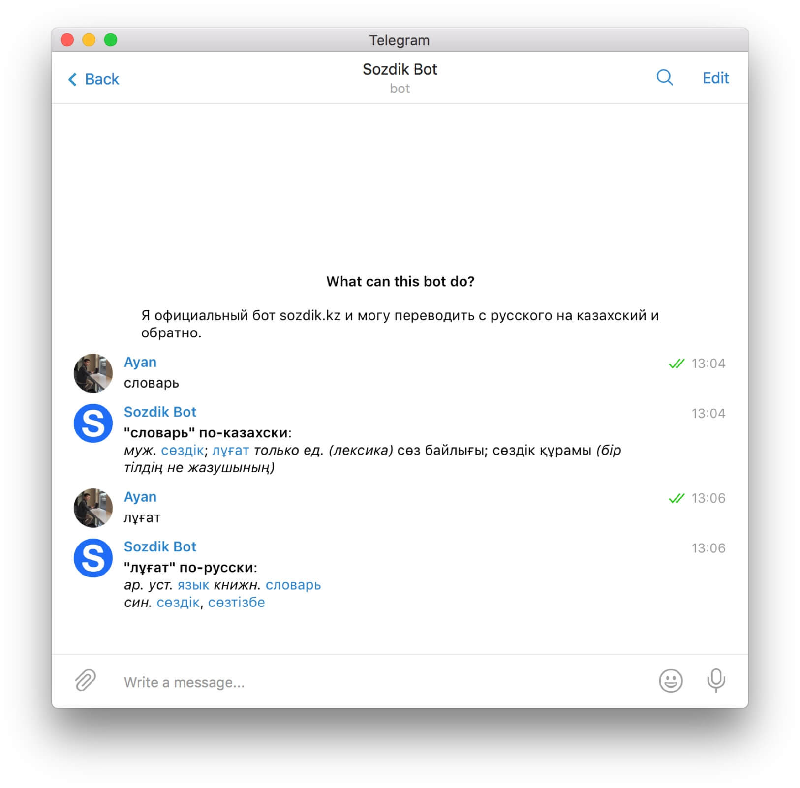
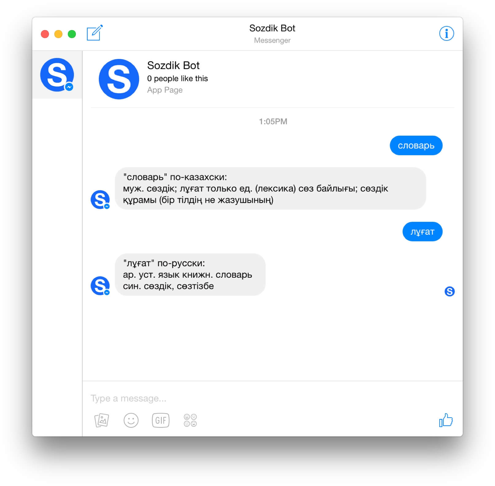

Больше года назад я [написал простого бота на Telegram](https://sozdik.kz/ru/news/telegram/) для русско↔︎казахского онлайн словаря [sozdik.kz](https://sozdik.kz). 

Это был мой первый опыт в этом деле, и будучи комфортным в Питоне, первую версию бота я написал именно на этом языке. С тех пор, однако, бот был полностью переписан, и со старой версией сейчас не имеет практически ничего общего. Более того, с появлением [поддержки ботов в Facebook Messenger](https://developers.facebook.com/blog/post/2016/04/12/bots-for-messenger/), я решил попробовать расширить функционал бота и на эту платформу. Сегодня я рад объявить, что весь исходный код для Sozdik Bot [доступен публично на GitHub](https://github.com/anvilabs/sozdik-bot).

<!-- more -->

В этом проекте есть несколько вещей, которые делают его действительно интересным:

- Сервер для бота был написан на [ES6](http://es6-features.org/) с поддержкой [экспериментального синтаксиса](https://tc39.github.io/process-document/).
- Для добавления статического анализа кода был использован [Flow](https://flowtype.org/) – новый инструмент от Facebook-а.
- Практически каждая строка исходного кода бота покрыта тестами с помощью [Jest](http://facebook.github.io/jest/). Особенно крутым в этом тест раннере является его инновационная функция [Snapshot тестов](https://facebook.github.io/jest/blog/2016/07/27/jest-14.html#why-snapshot-testing).
- Загрузка бота на сервер осуществляется через связку [Docker](https://www.docker.com/what-docker) ➞ [Docker Compose](https://docs.docker.com/compose/overview/) ➞ [Docker Machine](https://docs.docker.com/machine/overview/). Подробнее об этом в другом посте.
- В качестве вебсервера для бота используется [Caddy](https://caddyserver.com/) – современная альтернатива Nginx и Apache, умеющая автоматически настраивать SSL сертификаты через [Let's Encrypt](https://letsencrypt.org/).

Каждая из перечисленных технологий в данный момент развивается крайне стремительно и конечно же заслуживает отдельного поста. Так что следите за обновлениями! 

Добавьте Sozdik Bot к себе в [Telegram](https://telegram.me/SozdikBot) или [Messenger](http://m.me/sozdikbot) и [пишите мне](mailto:ayan@anvilabs.co) с любыми вопросами по поводу бота.
