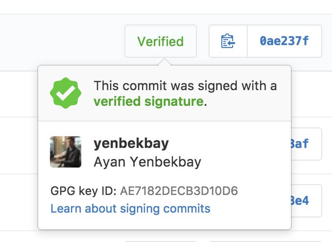

Недавно в [GitHub](https://github.com/blog/2144-gpg-signature-verification) официально [добавили систему](https://github.com/blog/2144-gpg-signature-verification) для проверки подлинности коммитов с помощью GPG ключей. Если вы сейчас в замешательстве и не понимаете о чём идет речь, в документации Git есть [отличный ресурс, посвященный это теме](http://bit.ly/2dIVZOL).

В этой статье я приведу краткую пошаговую инструкцию о том, как настроить автоматические подписи ваших коммитов в GitHub. Несмотря на то, что инструкция в первую очередь направлена на пользователей macOS, большинство команд должны работать и на других платформах.

После того, как вы выполните все шаги в этой инструкции, у ваших коммитов в GitHub появятся вот такие симпатичные зеленые индикаторы:



## Настройка Keybase

Для генерации и хранения GPG ключей мы будем использовать [Keybase](https://keybase.io/) – сервис, который делает работу c GPG удобной и безболезненной.
Чтобы использовать Keybase, вам необходимо зарегистрироваться на [их сайте](https://keybase.io/). Для регистрации, однако, вам потребуется приглашение. У меня есть больше десятка неиспользованных приглашений – поэтому, [напишите мне](mailto:ayan@anvilabs.co), если вам нужно одно. В противном случае, встаньте в очередь и вернитесь к этой статье, когда вам придет заветное приглашение.

После того, как вы зарегистрируетесь в Keybase, зайдите в терминал и запустите следующие команды:
```bash
# установите Homebrew, если его у вас еще нет
$ [ ! -f "`which brew`" ] && /usr/bin/ruby -e "$(curl -fsSL https://raw.githubusercontent.com/Homebrew/install/master/install)"
# установите Keybase и GPG2
$ brew install keybase gnupg2
# войдите в ваш аккаунт на Keybase
$ keybase login
```

## Генерирование GPG ключа

Дальше создайте новый GPG ключ, используя ваше настоящее имя и email, сохраненный в GitHub:
```bash
$ keybase pgp gen
# Enter your real name, which will be publicly visible in your new key: Ayan Yenbekbay
# Enter a public email address for your key: ayan.yenb@gmail.com
# Enter another email address (or <enter> when done): ayan@anvilabs.co
# Enter another email address (or <enter> when done):
# Push an encrypted copy of your new secret key to the Keybase.io server? [Y/n] Y
# ▶ INFO PGP User ID: Ayan Yenbekbay <ayan.yenb@gmail.com> [primary]
# ▶ INFO PGP User ID: Ayan Yenbekbay <ayan@anvilabs.co>
# ▶ INFO Generating primary key (4096 bits)
# ▶ INFO Generating encryption subkey (4096 bits)
# ▶ INFO Generated new PGP key:
# ▶ INFO   user: Ayan Yenbekbay <ayan.yenb@gmail.com>
# ▶ INFO   4096-bit RSA key, ID F85D29E6944656BA, created 2016-10-22
# ▶ INFO Exported new key to the local GPG keychain
```

## Настройка автоматических подписей Git коммитов

Используя email, введенный в предыдущем шаге, укажите Git применять его при подписи коммитов:
```bash
$ git config --global user.signingkey <ваш_email>
$ git config --global commit.gpgsign true
$ git config --global gpg.program $(which gpg2)
```

## Добавление вашего GPG ключа в GitHub

Cкопируйте ваш сгенерированный PGP ключ:
```bash
$ keybase pgp export | pbcopy
```

Теперь перейдите в [настройки GitHub](https://github.com/settings/keys), нажмите на кнопку "New GPG key" и вставьте полученный ключ в поле ввода.

## Заключение

На этом всё. Теперь когда вы будете создавать новый коммит, он будет подписываться с помощью вашего GPG ключа. Если запушив подписанные коммиты в GitHub, вы увидите возле них значки "Verified" – значит, вы все сделали правильно.

[Дайте мне знать](mailto:ayan@anvilabs.co), если у вас есть предложения по улучшению этой инструкции.
