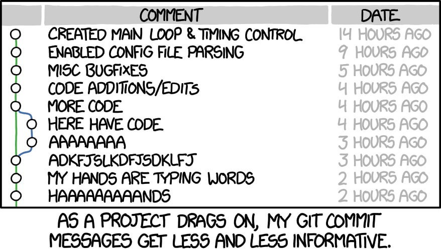
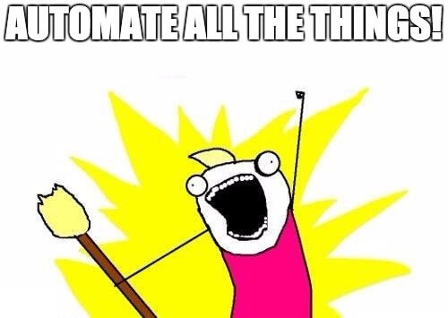
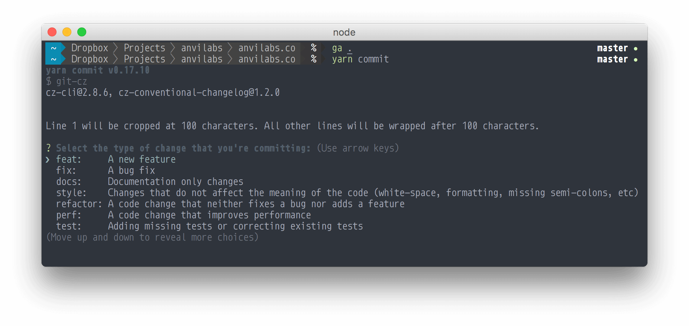
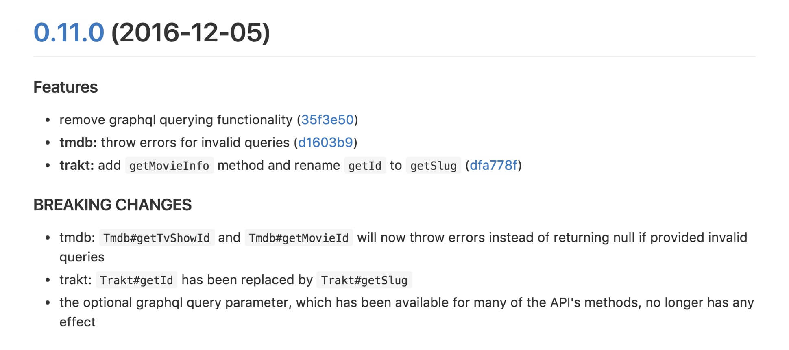

Работая с git, [очень легко](http://www.stackprinter.com/export?service=stackoverflow&question=909338&printer=false&linktohome=true) уделить недостаточно внимания одной его очень важной составляющей – написанию комментариев к коммитам. В то же время, участники крупных Open Source проектов знают, что качественные сообщения у коммитов – это лучший способ передать контекст проделанных изменений своим коллегам (и особенно будущему себе). Ведение продуманных комментариев к коммитам позволит участникам вашей команды быстро вливаться в курс дела, тем самым экономя всем время и нервы.

<!-- more -->

[{width="439"}](http://xkcd.com/1296/)

В этой статье я расскажу о том, какой стиль оформления коммитов мы используем в Anvilabs, и как он помог упростить нам жизнь.

## Стиль написания коммитов

Вот уже несколько месяцев наша команда следует [правилам написания коммитов](https://gist.github.com/stephenparish/9941e89d80e2bc58a153#format-of-the-commit-message), возникшим в проекте AngularJS. Согласно этим правилам, сообщение коммита должно состоять из трёх частей:

```
<type>(<scope>): <subject>
```

- `<type>` – тип коммита, должен быть один из следующих:
  - `feat`: добавление нового функционала
  - `fix`: исправление какой-либо программной ошибки
  - `docs`: изменения в документации
  - `style`: изменения в коде, не затрагивающие его содержание (форматирование, добавление точек с запятой и т.д.)
  - `refactor`: изменения в коде, не исправляющие ошибок и не добавляющие новый функционал
  - `perf`: изменения в коде, улучшающие произодительность
  - `test`: добавление новых тестов или исправление существующих
  - `chore`: любые другие изменения, не затрагивающие код
- `<scope>` – уточнение места или функционала, затронутого изменением в коммите (название файла, масштаб изменения и т.д.)
- `<subject>` – содержание сообщения, "что именно было сделано?"

К написанию текста в `<subject>` также имеются несколько ограничивающих требований:
- предложение должно начинаться с глагола в неопределенной форме – т.е. `change` а не `changed` или `changes`
- первая буква предложения должна быть строчной
- в конце предложения _**не**_ должна ставиться точка (`.`)
- длина строки _**не**_ должна превышать 72 символа (в идеале 50 символов) – GitHub обрезает сообщение коммита, если оно длиннее этой отметки

Добавление `<scope>` может быть выборочным – так, например, мы иногда его не добавляем.

Если вы работаете в достаточно большой команде, вы можете добавить в сообщение коммита более детальное описание проделанных изменений. Писать про это я тут не буду, но рекомендую почитать этот [отличный пост от Тима Поупа](http://tbaggery.com/2008/04/19/a-note-about-git-commit-messages.html).

## Автоматическая валидация сообщений коммитов

Вы можете добавить следующую автокоманду в ваш `~/.vimrc`, чтобы ограничивать длину строки в сообщениях коммитов на 72-ой колонке:
```
autocmd Filetype gitcommit textwidth=72
```

{width="500"}

Более универсальным способом проверки сообщений, однако, будет использование функции перехватчиков (hooks) в git. Мы в команде Anvilabs для этого используем npm скрипты совместно с [husky](https://github.com/typicode/husky). Чтобы сэкономить вам немного времени, я привожу инструкцию по настройке git перехватчика для проверки коммитов:

0. Убедитесь, что у вас установлен `node` и вы находитесь в проекте с файлом `package.json`
1. Установите необходимые модули, запустив следующие команды в терминале:
```bash
$ yarn add husky validate-commit-msg --dev # npm install husky validate-commit-msg --save-dev
```
2. Добавьте следующие изменения в ваш `package.json`:
```json
{
  ...
  "scripts": {
    ...
    "commitmsg": "validate-commit-msg",
    ...
  },
  ...
  "config": {
    ...
    "validate-commit-msg": {
      "maxSubjectLength": 72,
      "types": "conventional-commit-types"
    },
    ...
  },
  ...
}
```

Добавленный скрипт будет запускаться каждый раз, когда вы будете создавать новый коммит в репозитории. `validate-commit-msg` будет проверять сообщения коммитов на соответствие нужному нам формату. Более того, указанная конфигурация добавит дополнительную проверку сообщений коммитов на ограничение длины в 72 колонки и на присутствие указанного типа в списке [`conventional-commit-types`](https://github.com/commitizen/conventional-commit-types).

_Побольше узнать о конфигурации `validate-commit-msg` вы можете в [репозитории модуля](https://github.com/kentcdodds/validate-commit-msg)._

## Следование правилам написания коммита для новичков

{width="927"}

Если вам тяжело привыкнуть к новому способу написания коммитов, вам может пригодиться [`commitizen`](http://commitizen.github.io/cz-cli/). `commitizen` - это специальная утилита для генерации коммитов по определенным указанным параметрам. Вы можете установить его глобально или, как мы рекомендуем, локально в вашем проекте. Использовать `commitizen` вовсе не обязательно, но если вы хотите его попробовать – вот небольшая инструкция:

1. Установите необходимые модули, запустив следующие команды в терминале:
```bash
$ yarn add commitizen cz-conventional-changelog --dev # npm install commitizen cz-conventional-changelog --save-dev
```
2. Добавьте следующие изменения в ваш `package.json`:
```json
{
  ...
  "scripts": {
    ...
    "commit": "git-cz",
    ...
  },
  ...
  "config": {
    ...
    "commitizen": {
      "path": "cz-conventional-changelog"
    },
    ...
  },
  ...
}
```
3. Теперь при создании нового коммита вместо `git commit` используйте `yarn commit` или `npm run commit`

_Побольше узнать о конфигурации `commitizen` вы можете в [репозитории модуля](https://github.com/commitizen/cz-cli)._

## Автоматическое создание новых версий модуля и ведение CHANGELOG

Главная прелесть стиля оформления коммитов AngularJS в том, что с помощью полученных коммитов можно с легкостью генерировать качественный CHANGELOG. Если вы не знаете, что такое CHANGELOG или зачем он нужен, люди создали на эту тему специальный сайт: [keepachangelog.com](http://keepachangelog.com/ru). Как вы понимаете, ведение CHANGELOG очень важно, а его отсутствие приводит к боли и страданиям.

{width="552"}

Ведение CHANGELOG не должно быть обременяющим – поэтому, были придуманы такие штуки как [`standard-version`](https://github.com/conventional-changelog/standard-version) и [`semantic-release`](https://github.com/semantic-release/semantic-release). Эти два инструмента очень похожи, но при этом каждый из них имеет важные особенности и лучше подходит в определенных обстоятельствах.

В своих проектах я предпочитаю использовать `standard-version`, так как он даёт больше контроля над публикацией. Использовать его очень просто:

1. Установите `standard-version` локально:
```bash
$ yarn add standard-version --dev # npm install standard-version --save-dev
```
2. Добавьте скрипт в ваш `package.json`:
```json
{
  ...
  "scripts": {
    ...
    "release": "standard-version",
    ...
  },
  ...
} 
```
3. Теперь для создания новой версии вашего модуля используйте `yarn release` или `npm run release` ✨

### Что же происходит при вызове этой команды?

Во-первых, `standard-release` автоматически определяет следующую версию модуля по истории ваших последних коммитов. 

Так, например, если с момента публикации последней версии вы не добавляли серьезных изменений или добавляли только изменения типа `fix`, то по канонам [семантического версионирования](http://semver.org/lang/ru/), `standard-release` создаст патч-версию. По тому же принципу, коммиты типа `feat` приводят к созданию минорной версии, а коммиты с текстом `BREAKING CHANGE:` приводят к созданию мажорной версии.

[{width="970"}](https://github.com/anvilabs/movie-api/blob/master/CHANGELOG.md)
Отрывок из `CHANGELOG.md` в репозитории [movie-api](https://github.com/anvilabs/movie-api)
{.captioned-image}

После применения новой версии в `package.json` обновляется `CHANGELOG.md`. Для генерации текста в `CHANGELOG.md` используется [`conventional-changelog`](https://github.com/conventional-changelog/conventional-changelog). Чтобы узнать, как именно происходит этот процесс, вы можете взглянуть [сюда](https://github.com/bcoe/conventional-changelog-standard/blob/master/convention.md).

И наконец, после обновления `CHANGELOG.md` `standard-release` создает коммит со всеми изменениями и тег с новой версией. После всего этого вы можете запушить все коммиты и опубликовать новую версию в npm.

Классно же, нет? 😁
